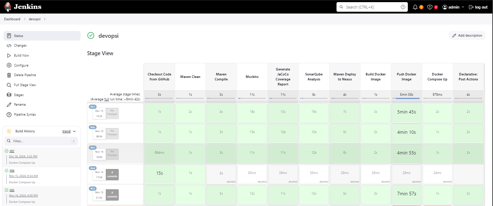

# Project Name

## Description
This is a Spring Boot application containerized using Docker. The project includes unit tests implemented with JUnit and Mockito for thorough testing.

---

## Prerequisites
Make sure you have the following installed:

- **Java 17** (or compatible version)
- **Maven** (for building the project)
- **Docker** and **Docker Compose**

---

## Project Structure
```
.
|-- src/              # Application source code
|-- pom.xml           # Maven configuration
|-- Dockerfile        # Docker build file
|-- docker-compose.yml
|-- README.md         # This file
```

---

## Building the Project

### 1. Build the Spring Boot Application
Run the following command to build the project and package it as a JAR file:
```bash
mvn clean package
```

This will generate a JAR file in the `target/` directory.

### 2. Build the Docker Image
Use the `Dockerfile` to build the Docker image for the Spring Boot application:

```bash
docker build -t springboot-app .
```

- `-t springboot-app`: Tags the image with the name "springboot-app".

### 3. Run the Application Using Docker Compose
Start the application along with its required services (e.g., database) using Docker Compose:

```bash
docker-compose up
```

---

## Testing the Application

### Run Unit Tests
JUnit and Mockito are used to write and execute unit tests.
Run the tests with Maven:

```bash
mvn test
```

The test results will be displayed in the console, and reports can be found under:
```
target/surefire-reports/
```

---

## Accessing the Application
Once the container is running, you can access the Spring Boot application at:

```
http://localhost:8080
```

> **Note:** Ensure the `docker-compose.yml` file maps the port 8080 correctly.

---

## Stopping the Application
To stop and remove the running containers, execute:

```bash
docker-compose down
```

---

## Additional Notes
- Update `application.properties` or `application.yml` for externalized configurations like database settings.
- Unit tests are located under `src/test/java`.

---

## Screenshots

### Screenshot 1



## Author
Mohamed Amine Mguidich
